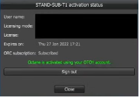
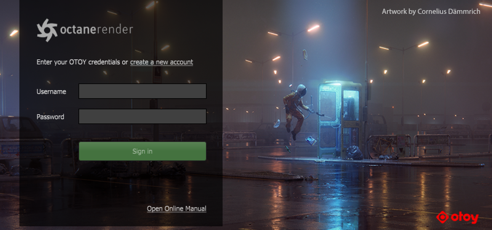
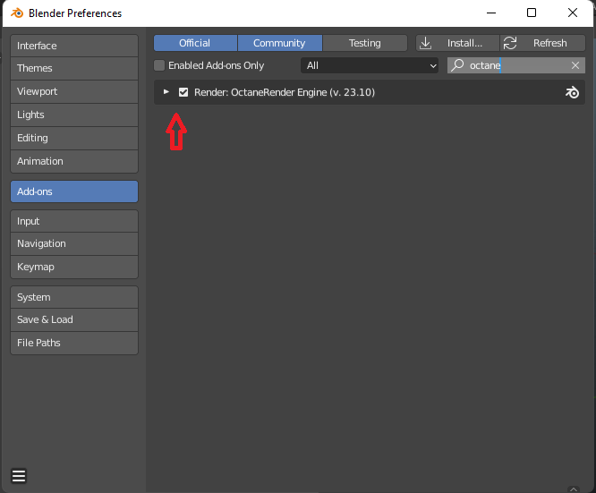
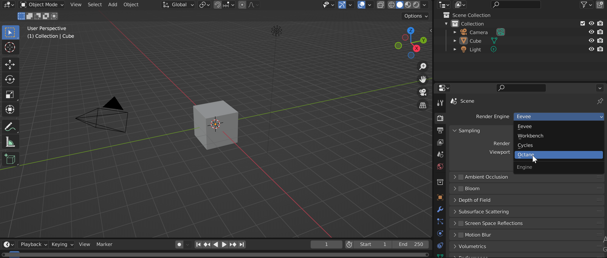

# Installing the OctaneRender® engine in Blender Octane Edition

## Get started with Octane for Blender

### System Requirements

OctaneRender® requires [NVIDIA graphics card](https://developer.nvidia.com/cuda-gpus) that supports CUDA 10.1 with the latest drivers.&#x20;

Blender Octane Edition is available for download on Windows, macOS, and Linux. Blender has a set of [minimum and recommended requirements](https://www.blender.org/download/requirements/); so make sure these are met before trying to install Blender.

### Installing OctaneRender®

To find the latest version of the OctaneRender® free tier go to the [OTOY website](https://home.otoy.com/render/octane-render/) and click in the "Free Trial" option on the left column menu.

<figure><figcaption></figcaption></figure>

Choose the option OctaneRender® Prime (Free Tier) on the top menu.

Click in the "Try Now" button to create your OTOY account and follow the instructions provided [here](https://account.otoy.com/sign\_up).&#x20;

After you create the account, a verification email should have been sent to your email address, so follow the instructions within to validate your OTOY account.

After validating your OTOY account, you will be redirected to this page to download and install both the Blender Octane Edition and the OctaneRender™ Prime Free Tier server.&#x20;

<figure><figcaption></figcaption></figure>

Blender Octane Edition is a full working copy of Blender with an Octane server bridge plugged in. It works by sending the scene data from Blender to the Octane server for rendering, then the Octane server sends the image back to Blender for display.

<figure><figcaption></figcaption></figure>

### Activating the OctaneRender®

After downloading both OctaneServer and the matching Blender Octane Edition installers, install the OctaneServer first, and then install the Blender Octane Edition. Follow the on screen instructions and accept all permissions.&#x20;

When your installation process is done, run the Octane server first. Double click the task bar icon and log in with your OTOY account username and password in both windows that will prompt in the screen.

<figure><figcaption></figcaption></figure>

<figure><figcaption></figcaption></figure>

### Activating the Blender Octane Edition

Open Blender Octane Edition, and activate the OctaneRender® plug in.

Go to "Edit", "Preferences" and choose the "Add-ons" option in the left column menu.&#x20;

Search for "Octane" in the search bar and make sure to click the checkbox to activate the engine.

<figure><figcaption></figcaption></figure>

For the last step, choose the Octane render engine in the right panel menu of the Blender view port.

<figure><figcaption></figcaption></figure>

Now you have successfully installed the OctaneRender® for Blender.&#x20;

### **Additional Online Resources**

&#x20;[OctaneRender online documentation ](https://docs.otoy.com/BlenderH/BlenderPluginManual.htm)

&#x20;[Blender Manual ](https://docs.blender.org/manual/en/latest/index.html)

&#x20;[OctaneRender for Blender cheatsheet](https://help.otoy.com/hc/en-us/articles/6727490530331-OctaneRender-for-Blender-Cheatsheet)

****
